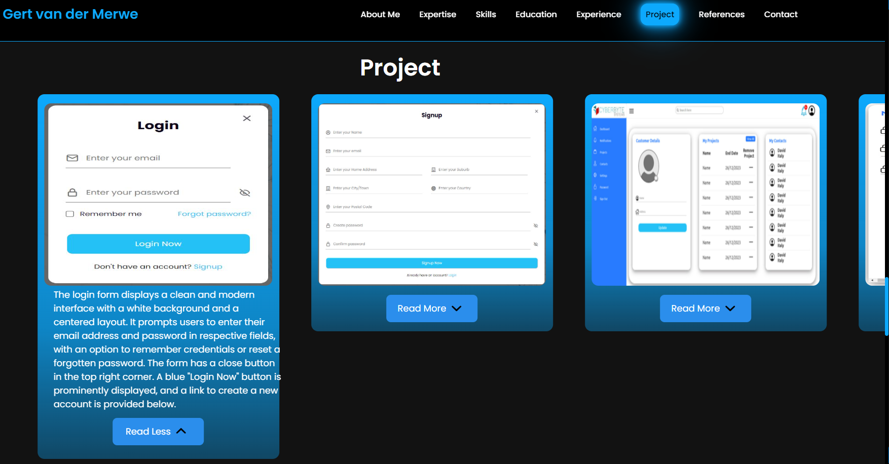

# Gert-van-der-Merwe-CV

# Introduction
Welcome to the documentation for my portfolio website. This README outlines the design and development decisions I made, as well as the functionalities implemented. This will help you understand the internal workings of my project.

## Links
LinkedIn: https://www.linkedin.com/in/gert-van-der-merwe-182b47312/

Group Repository: https://github.com/AJLaubscher/HMS_TL_System

## Layout and Design

### Heading and Navbar

The heading and navigation bar are designed to provide a clear and intuitive way to navigate through the portfolio. The navbar includes links to the main sections(About Me, Expertise, Education, Experience, Project, References, Contact) of the portfolio website, ensuring easy access to all relevant content.

### About Me Section

The About Me section introduces who I am, my background, and my professional journey. It is designed to give a quick overview of my profile and experience. The infinite typing text indicates my technical expertise. Additionally, there are two buttons for links to my LinkedIn page and GitHub portfolio project repository. There is also a contact me button that smoothly scrolls to the contact section.

### Technical Expertise Section

This section highlights my technical expertise in various areas. Each container has an expertise title with a description. If you click read more, the container expands to show the remaining section of the description.

### Skills Section
The Skills section showcases my core competencies and skills. It indicates a main container with sub-containers with a skill image logo, and a title of each sub-container for each skill. If you hover over a specific skill sub-container, its' scale increases by 30%.

### Education Section

The Education section displays my academic background. It is organized to show the institutions attended, degrees earned, and relevant educational achievements. It consists of two containers for the relevant educational sections, with a title indicating the type of education(Tertiary/Secondary), followed by the education title, year completed/expected completion and the name of the institution. The image on the right side of the container is a logo for the institution. If you hover on a container, the scale increases and background colour changes from black to blue.

### Experience Section

In the Experience section, I outline my professional experience, including previous roles, responsibilities, and significant projects. This section demonstrates my practical application of skills in real-world scenarios. It consists of a container centred in the experience section. The container has an experience title, followed by the company title and period of work. This is followed by a description of the experience. Additionally, there is scroll animation.

### Project Section

The Project section features a key project I have worked on. It consists of several slides animated with pagination. Each slide contains an image of a form of the project, a description of the form underneath, and a read more/read less button.
Swiper.js Integration
I used Swiper.js in the project to create interactive and responsive sliders. 

### References Section

The References section consists of a container with an image of the company logo. On the right side is a title of the Company. Beneath the title is the name of my boss, followed by his position and contact information. If you hover on the container, the scale increases and background changes to blue. Additionally, there is scroll animation.

### Contact Section

The Contact section provides ways to get in touch with me. It consists of a container with contact details and an email contact form for direct communication and a submit button with hover animation changing the background of the button to blue. Additionally, there are two buttons for links to my LinkedIn page and GitHub portfolio project repository. There is also a Download CV button which takes you to a downloadable pdf of my CV. 

### Footer

The footer includes links to the main sections. Additionally, there are two buttons for links to my LinkedIn page and GitHub portfolio project repository.

### Conclusion

This documentation provides an overview of the decisions made during the development of my portfolio website. 